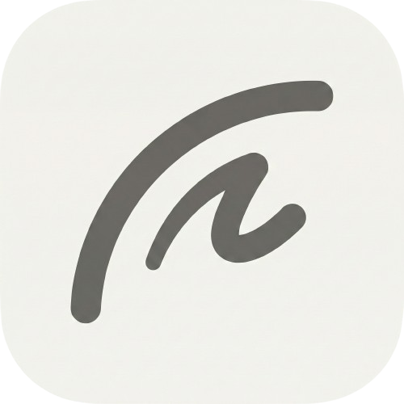

<p align="center">
  
</p>

<h1 align="center">Tempo</h1>

<p align="center">
  <strong>A sleek video speed & export utility for macOS</strong>
</p>

<p align="center">
  <a href="https://github.com/samirpatil2000/Tempo/releases/latest">
    
  </a>
  
  
</p>

---

## ✨ Features

- **🚀 Speed Control** — Export videos at 1×, 2×, 3×, or 4× playback speed
- **📺 Quality Options** — Choose Original, 480p, 720p, or 1080p output
- **📂 Drag & Drop** — Simply drop video files onto the app
- **📊 Real-time Progress** — Circular progress indicator with estimated file size
- **🌙 Dark Mode** — Beautiful automatic light/dark theme support
- **🎨 Apple 2026 Design** — Modern glassmorphic UI with smooth animations
- **⚡ Lightweight** — Minimal, focused utility that does one thing well

---

## 📥 Download

<p align="center">
  <a href="https://github.com/samirpatil2000/Tempo/releases/download/v1.0/Tempo.dmg">
    
  </a>
</p>

> **Note:** Tempo is not notarized with Apple Developer ID. On first launch:
> 1. Right-click on **Tempo.app**
> 2. Click **Open**
> 3. Click **Open** in the security dialog

---

## 🚀 Getting Started

1. **Download** the `.dmg` file from above
2. **Drag** Tempo to your Applications folder
3. **Launch** Tempo
4. **Drop** a video file onto the app (or click to browse)
5. **Select** your speed and quality options
6. **Export** — choose where to save and you're done!

---

## 🖥️ Screenshots

<p align="center">
  <!-- Add your screenshot here -->
  


</p>

---

## 🎬 Supported Formats

| Input | Output |
|-------|--------|
| `.mov` | `.mp4` |
| `.mp4` | `.mp4` |
| `.avi` | `.mp4` |
| QuickTime | H.264 |

---

## 🛠️ Building from Source

```bash
# Clone the repository
git clone https://github.com/samirpatil2000/Tempo.git
cd Tempo

# Open in Xcode
open Tempo.xcodeproj

# Build and run
# Press ⌘R in Xcode
```

### Requirements
- macOS 12.0 or later
- Xcode 15.0 or later
- Swift 5.9

---

## 📁 Project Structure

```
Tempo/
├── TempoApp.swift           # App entry point
├── Theme.swift              # Colors, materials & animations
├── Models/
│   ├── AppState.swift       # App state management
│   └── Resolution.swift     # Speed & resolution enums
├── Processing/
│   └── VideoProcessor.swift # Video export engine
└── Views/
    ├── ContentView.swift       # Main layout
    ├── DropZoneView.swift      # Drag & drop zone
    ├── SelectorViews.swift     # Segmented controls
    └── ExportButtonView.swift  # Export button & progress
```

---

## 🤝 Contributing

Contributions are welcome! Feel free to:
- Report bugs
- Suggest features
- Submit pull requests

---

## 📄 License

MIT License — feel free to use this project however you like.

---

<p align="center">
  Made with ❤️ for macOS
</p>
